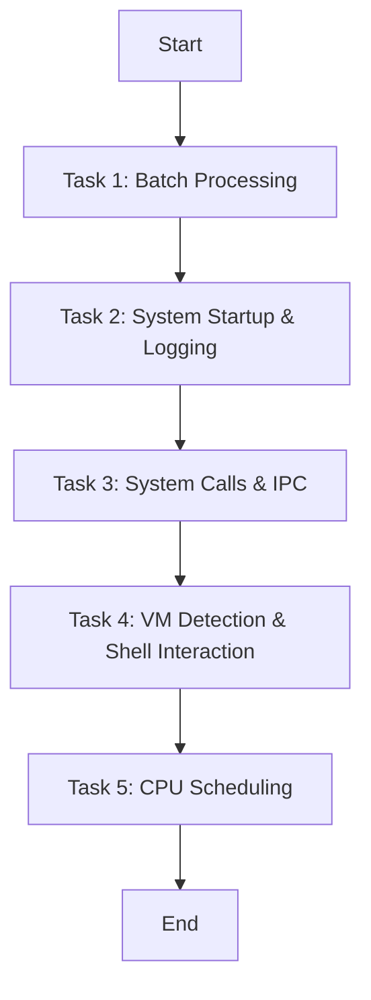

# 🧠 Operating Systems Lab Assignments  
**Submitted by:** *Lokesh Deshwal*  
**Course:** B.Tech CSE (Data Science)  
**Semester:** 5  
**Roll No:** 2401421062

---

## 📘 Overview
This repository contains **three Operating Systems lab assignments** completed as part of the 5th-semester curriculum.  
Each assignment demonstrates the implementation of **core OS concepts** through **practical programming in C and Python** on a Linux environment.

---

## 🧩 Assignment 1 — Process Management in Linux
**Objective:** Understand process creation, execution, and management using system calls.  

### **Included Tasks:**
1. **Creating and Managing Processes:** Using `fork()` to create multiple child processes.  
2. **Executing External Commands:** Using `exec()` to run commands like `ls -l`.  
3. **Special Process States:** Demonstrating **Zombie** and **Orphan** processes.  
4. **Process Information Access:** Reading process details from the **`/proc` filesystem**.  
5. **Process Priority Management:** Adjusting CPU scheduling priority using the **`nice`** command.  

📄 **Files Included:**  
- `process_management.py`  
- `output.txt`  
- `OS_Lab_Assignment 1.docx`  
- `Assignment - OS_Report.pdf`  
- `Task 1 & 2.png`, `Task 3.png`, `Task 4 & 5.png`, `Task 5.png`

---

## ⚙️ Assignment 2 — Process Scheduling and Subtasks
**Objective:** Implement various CPU scheduling algorithms and explore multi-process operations.  

### **Included Components:**
- **Subtasks:**  
  - Process creation and joining (`subtask1_logging.py`, `subtask2_function.py`, etc.)  
  - Logging and inter-process communication  
- **Scheduling Algorithms:**  
  - **FCFS (First Come First Serve)**  
  - **SJF (Shortest Job First)**  
  - **Round Robin Scheduling**  

📄 **Files Included:**  
- `Scheduling/fcfs.py`  
- `Scheduling/sjf.py`  
- `Scheduling/round_robin.py`  
- `Scheduling-Report.pdf`  
- `process_log.txt`  
- `subtask1_logging.py`, `subtask2_function.py`, `subtask3_process_creation.py`, `subtask4_process_join.py`  

---

## 💾 Assignment 3 — Advanced OS Concepts: Scheduling & Memory Management
**Objective:** Extend understanding of OS by implementing **scheduling and memory allocation** strategies.

### **Included Tasks:**
1. **Task 1 — Scheduling Algorithm Implementation**  
   - Simulate basic process scheduling using Python.  
4. **Task 4 — Memory Allocation Strategies**  
   - Simulate **Best-Fit**, **Worst-Fit**, and **First-Fit** memory allocation.  
5. **Task 5 — MFT and MVT Simulation**  
   - Implement **Multiprogramming with Fixed Tasks (MFT)** and **Variable Tasks (MVT)** strategies.  

📄 **Files Included:**  
- `task1_scheduling.py`  
- `task4_memory_allocation.py`  
- `task5_mft_mvt_simulation.py`  
- `OS_Assignment3_Report.pdf`

# OS Lab Assignment 4

Task 1: Batch Processing

Approach: Sequential subprocess execution of Python scripts.
Evidence (screenshot refs): screenshots/task1.png
Output snippet: See outputs/task1_batch_output.txt.

Task 2: System Startup & Logging

Approach: multiprocessing to spawn processes, logging to a file.
Evidence: screenshots/task2.png
Log file: outputs/system_log.txt.

Task 3: System Calls & IPC

Approach: C program demonstrating fork(), exec(), wait() and pipe; Python alternative with os.pipe + os.fork.
Evidence: screenshots/task3_exec.png, screenshots/task3_pipe.png
Outputs: outputs/task3_exec.txt, outputs/task3_pipe.txt.

Task 4: VM Detection & Shell Interaction

Approach: sysinfo.sh prints kernel/user/virt line; vm_detect.py uses systemd-detect-virt, CPU hypervisor flag, and DMI strings.
Evidence: screenshots/task4.png
Outputs: outputs/task4_sysinfo.txt, outputs/task4_vmdetect.txt.

Task 5: CPU Scheduling (FCFS, SJF, RR, Priority)

Approach: Non-preemptive FCFS/SJF/Priority; Round Robin with quantum. Calculates WT & TAT, averages.
Evidence: screenshots/task5_fcfs.png, screenshots/task5_sjf.png, screenshots/task5_rr.png, screenshots/task5_priority.png
Outputs: outputs/task5_*.txt.

Observations & Learnings

Batch processing simulates simple job queues.

Logging shows lifecycle of processes like OS boot/shutdown.

fork/exec/wait separate address spaces; pipes enable IPC.

VM detection is heuristic-based; multiple signals increase confidence.

Scheduling policies trade fairness vs. turnaround; RR improves responsiveness; SJF minimizes average WT when bursts known.

References

Linux man fork, man exec, man wait, man pipe

Python docs: multiprocessing, subprocess, os

